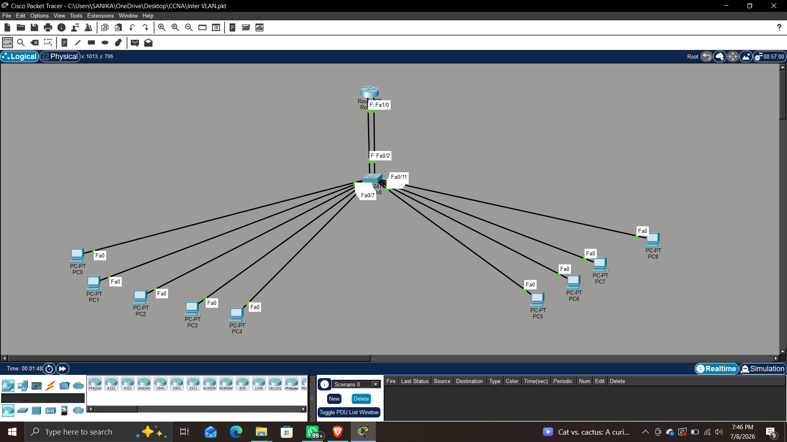
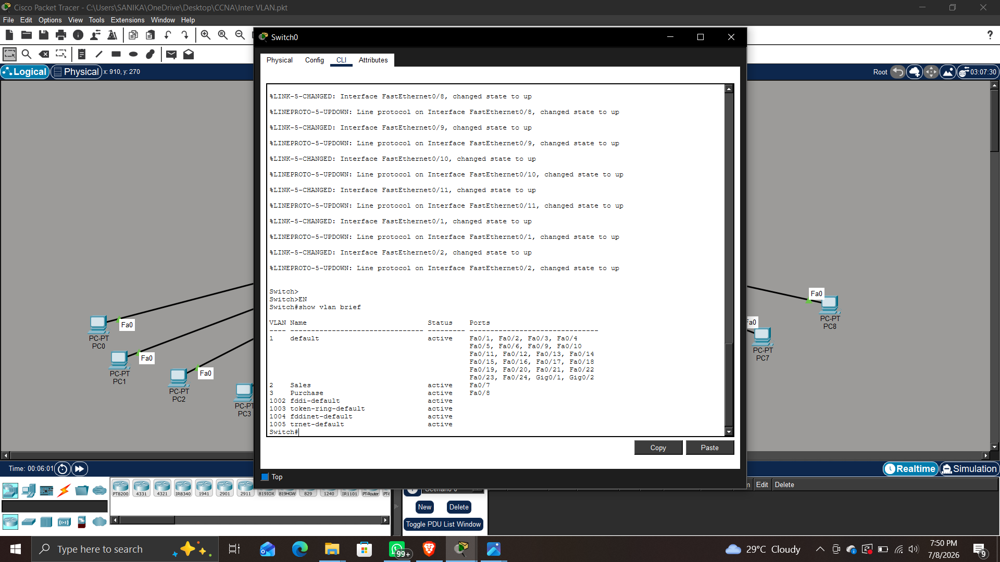
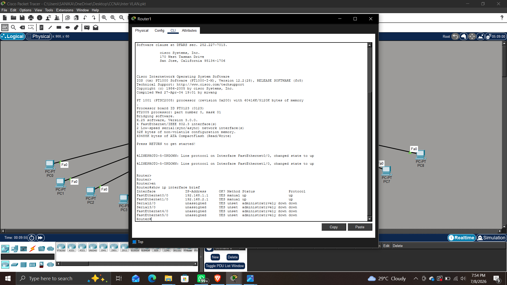
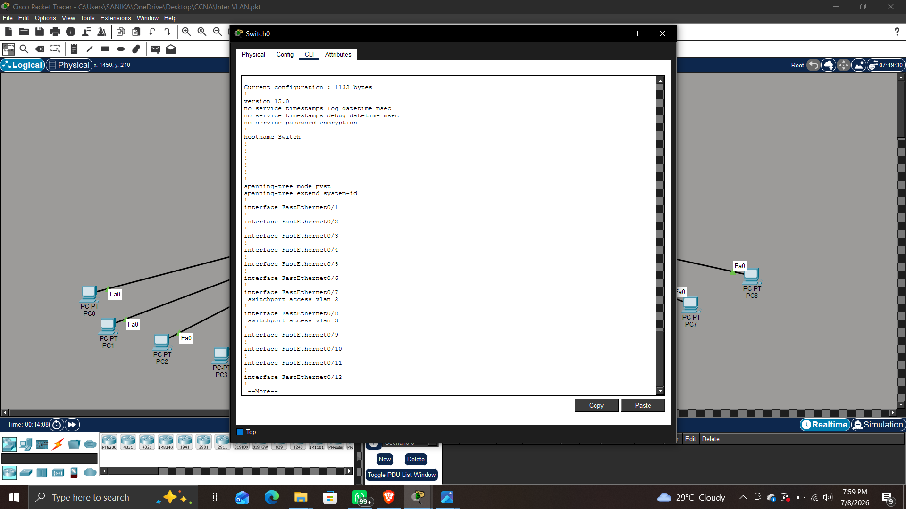
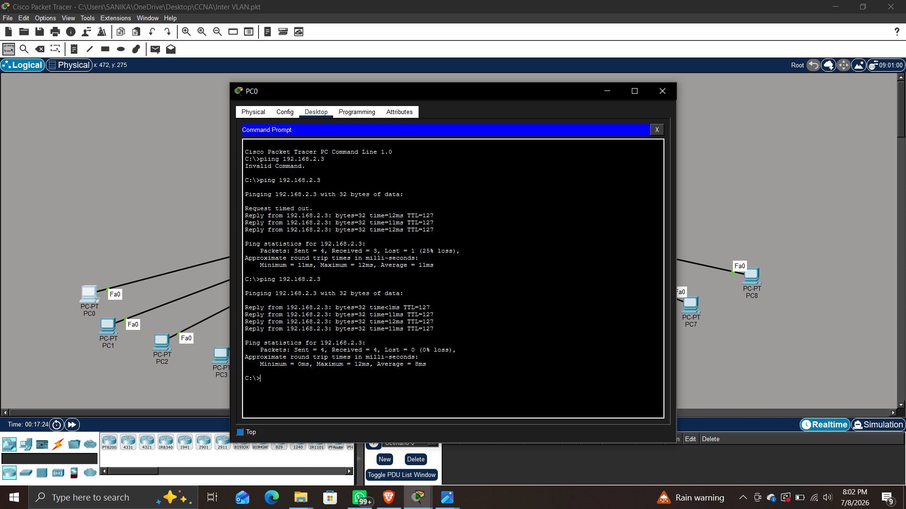
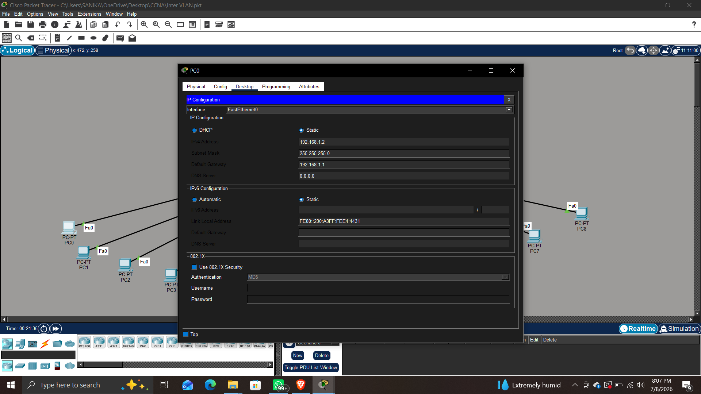

# Inter-VLAN Routing using Cisco Packet Tracer

## 📌 Project Overview

This project demonstrates the implementation of Inter-VLAN Routing in Cisco Packet Tracer. Multiple VLANs were created to logically separate devices into different networks. A Cisco router was configured to enable communication between the VLANs, allowing devices from different VLANs to exchange data successfully.

This project helped me understand VLAN configuration, IP addressing, router interface configuration, and network connectivity testing.

---

## 🎯 Objectives

- Create multiple VLANs on a Cisco switch.
- Assign switch ports to different VLANs.
- Configure router interfaces for routing between VLANs.
- Assign static IP addresses to all PCs.
- Verify communication between different VLANs using ping.

---

## 🛠️ Devices Used

- 1 Cisco Router
- 1 Cisco 2960 Switch
- 9 PCs
- Copper Straight-Through Cables
- Cisco Packet Tracer

---

## 🖥️ Network Topology

The topology consists of one router, one switch, and multiple PCs connected to different VLANs.

> **Topology Screenshot**



---

## 📷 Project Screenshots

### VLAN Configuration



---

### Router Configuration



---

### Switch Configuration



---

### Successful Ping Test



---

### IP Configuration



---

## ✅ Features

- VLAN Creation
- Switch Port Configuration
- Router Interface Configuration
- Static IP Addressing
- Inter-VLAN Communication
- Network Connectivity Testing
- Cisco IOS CLI Configuration

---

## 🧪 Verification

The following tests were successfully completed:

- VLANs configured successfully.
- Router interfaces configured correctly.
- PCs assigned valid IP addresses.
- Successful communication between different VLANs.
- Connectivity verified using Ping.

---

## 📂 Repository Contents

```
Inter-VLAN-Routing/
│
├── Inter VLAN.pkt
├── README.md
├── Topology.png
├── vlan-brief.png
├── router-config.png
├── switch-config.png
├── ping-test.png
└── ip-config.png
```

---

## 📚 Skills Learned

- VLAN Configuration
- IP Addressing
- Cisco Switch Configuration
- Cisco Router Configuration
- Basic Network Troubleshooting
- Cisco Packet Tracer

---

## 🚀 Future Improvements

- Add DHCP for automatic IP address assignment.
- Implement Access Control Lists (ACLs).
- Expand the network with additional VLANs.
- Improve network security with port security.

---

## 👩‍💻 Author

**Sanjana Dawre**

B.E. Computer Engineering Graduate

Cybersecurity Enthusiast | CCNA Learner

---

⭐ If you found this project helpful, feel free to star the repository!
